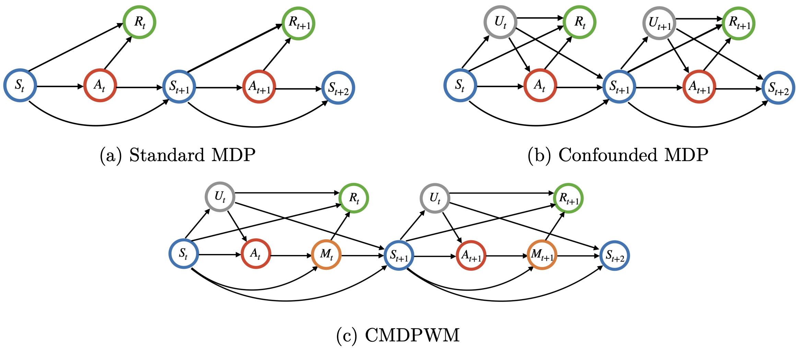

# Off-Policy Interval Estimation with Confounded Markov Decision Process (COPE)

This repository contains the implementation for the paper "[Off-Policy Confidence Interval Estimation with Confounded Markov Decision Process](https://arxiv.org/pdf/2202.10589.pdf)" (JASA, 2022) in Python.

## Summary of the Paper

This paper is concerned with constructing a confidence interval for a target policy's value offline based on a pre-collected observational data in infinite horizon settings. Most of the existing works assume no unmeasured variables exist that confound the observed actions. This assumption, however, is likely to be violated in real applications such as healthcare and technological industries. In this paper, we show that with some auxiliary variables that mediate the effect of actions on the system dynamics, the target policy’s value is identifiable in a confounded Markov decision process. Based on this result, we develop an efficient off-policy value estimator that is robust to potential model misspecification and provide rigorous uncertainty quantification. Our method is justified by theoretical results, simulated and real datasets obtained from ridesharing companies.



**Figure 1**: Causal diagrams for MDP, confounded MDP and confounded MDP with mediators (the focus of this paper). 

## Requirements
Change your working directory to this main folder, run `conda env create --file COPE.yml` to create the Conda environment, 
and then run `conda activate COPE` to activate the environment. 

## Code Description

The proposed estimators:
- `opeuc.py`: direct estimator, importance sampling estimator, confounded off-policy estimator

Nuisance parameters:
- `problearner.py`: learn transition probabilities: (i) state --> action & (ii) (state, action) --> mediator
- `qlearner.py`: fitted Q evaluation
- `rnnl.py`: marginal ratio learning via neural network
- `rll.py`: marginal ratio learning via linear model

Sampling:
- `simulator_save.py`: generate observations tuple from MDP

Utilities:
- `policy.py`: target policies
- `utilize.py`: some helpful functions
- `utilize_ci.py`: helpful functions for computing confidence intervals
- `utilize_prototypemodel.py`: helpful classes for simulations

Numerical experiments:

(See ACC form detailed for instructions)

- `sim_robust.py`: simulation for demonstrating double robustness
- `sim_time_compare.py` & `sim_time_compare_multdim.py`: simulation when time points vary
- `sim_trajectory_compare.py` & `sim_trajectory_compare_multdim.py`: simulation when the number of trajectories vary
- `sim_ratiolearner_compare.py`
- `sim_ratio_features_number_compare.py`

## Citations

Please cite the following publications if you make use of the material here. 

- Shi, C., Zhu, J., Ye, S., Luo, S., Zhu, H., & Song, R. (2022). Off-policy confidence interval estimation with confounded Markov decision process. Journal of the American Statistical Association, accepted.

```
@article{shi2022off,
  title={Off-policy confidence interval estimation with confounded Markov decision process},
  author={Shi, Chengchun and Zhu, Jin and Ye, Shen and Luo, Shikai and Zhu, Hongtu and Song, Rui},
  journal={Journal of the American Statistical Association},
  volume={accepted},
  year={2022},
  publisher={Taylor \& Francis}
}
```

## License

All content in this repository is licensed under the GPL-3 license.
