# 离线策略置信区间估计
<!-- ---------------------- -->

## 前言

好的策略需要同时兼顾短期与长期收益。以常见的商业平台为例，向用户发放合理的优惠券

- 从短期上来看，可以激励用户下单并减少库存

- 并增加用户对特定平台的使用频率，从而实现长期收益。

短期收益和长期收益的总和是策略累计收益。对于累计收益的充分了解，让我们对于商业策略的优劣有更明晰的洞悉。但目前，对于累计收益的认识还往往停留在主观与定性的表述。在大数据时代，如何借助已有数据量化累计收益，从而客观且精准地反映策略优劣是一个重要的问题。

## 背景介绍：顺风车平台

我们的研究受到在顺风车平台上应用客户推荐计划的例子启发的。假设客户在智能手机上启动顺风车应用程序。当他们输入目的地时，平台将向用户推送折扣券。不同策略将向用户提供不同的优惠券为乘车带来。这样做的推荐的目的是（i）增加客户订购此特定乘车的机会，并减少当地司机的空置期；（ii）增加客户将来更频繁使用该应用程序的机会。我们注意到（i）和（ii）分别对应于公司的短期和长期利益。我们希望评估在从顺风车公司收集的观察数据集上给定的客户推荐计划的累积效果。

然而，实际收集到的观测数据往往受到混杂因素的影响。例如，若某地举行演唱会时，可能会导致局部区域乘客需求增加，而司机供应减少。为了应对这种情况，平台可能会采取人为干预策略，例如增加乘客的等待时间或降低乘客的乘车优惠；然而，演唱会这一混淆因素并未被记录在所收集的数据中。虽然已有一些因果推断的方法可以处理混淆因素未观测的情况，但这些方法无法处理如下两个跟实际背景息息相关的两个需求：

1. 将商业上的短期收益和长期收益效应同时纳入考量；

2. 评估累计收益估计的不确定性，为判断商业策略间是否有显著差异提供支撑。

### 数据

<!-- 我们考虑从混淆的马尔可夫决策过程中生成的观察数据。 -->
<!-- 令$(S_t，A_t，R_t)$表示在$t$时刻观察到的状态-动作-奖励三元组。 -->
随着用户在第$t$时刻发起打车请求，平台会收集用户请求的状态信息，$S_t$，包括：订单的行程距离以及订单发起位置的供需平衡度量。基于请求的状态信息，平台会有一定的可能性向用户提供 8 折优惠券，这可以用一个二值变量 $A_t$。随后，用户从当次优惠券和已有的优惠券（如新人/节日优惠券等）挑选出最终折扣 $M_t$。如果用户确定下单，平台的收益$R_t$是最终折扣与原始订单报价的乘积。

注意到数据有几个特点。首先是平台会根据用户的状态$S_t$确定$A_t$。此外，前面提到 $A_t$ 还受未观测的混淆因素$U_t$的影响。其次，最终折扣$M_t$会受到$A_t$影响，并且在给定$A_t$后混淆因素不会影响到$M_t$。$M_t$会影响到平台的收益$R_t$和下一时刻的状态$S_{t+1}$，同时影响$R_t, S_{t+1}$的还有$U_t$和当前$S_t$。因此，我们可以假定，数据根据如下的有向图模型生成：

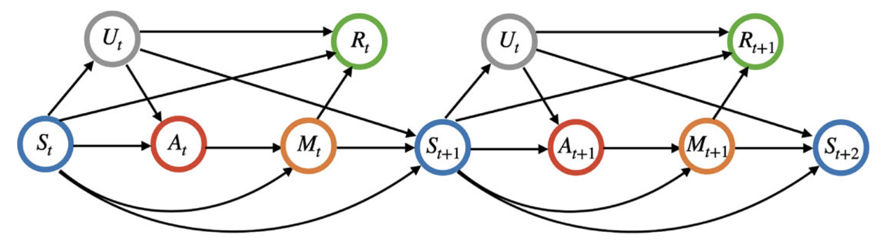

<!-- 其中 $S_t$, $U_t$, $A_t$, $M_t$, $R_t$ 分别表示第$t$时刻的状态，混淆因素，行动，中介变量，收益。 -->
<!-- 数据生成过程如下：在时间$t$，我们观察状态向量$S_t$，并且环境随机选择一些未测量的混淆因素$U_t∼p_u(•|S_t)$。然后，行动将会根据当前的状态以及混淆因素产生：$A_t∼p_a(•|S_t,U_t)$，中介变量$M_t$通过$p_m(•|A_t,S_t)$生成注意到$M_t$不受$U_t$影响。最后，当前时刻的奖励$R_t∼pr(•|M_t,S_t,U_t)$，环境转移到下一个状态$S_{t+1}∼p_s(•|M_t,S_t,U_t)$。 -->

### 研究目标

令$\pi(\cdot)$表示我们关心的策略，它的输入是状态信息$S_t$，并以此为根据确定到$t$时刻采取特定行动的概率。注意到，$\pi$ 与收集数据时用到的策略是不同的，因此，我们也称它为离线策略。它也不受到未观测的混淆因素的影响。

给定某个折现率 $\gamma \in [0, 1)$，我们定义策略的长期收益为：

$$\eta^\pi = E\left[ \sum_{t=0}^{\infty}\gamma^tE^\pi(R_t|S_0) \right],$$

其中期望$E^\pi[\cdot]$是通过假设系统策略服从$\pi$来定义的。我们的研究目标是：

> 基于以往其他策略收集到的数据，估计离线策略 $\pi$ 的累计收益 $\eta^\pi$ 并构建其关联的区间估计。

## 估计方法

### 可识别性

从$\eta^\pi$的定义是基于策略$\pi$定义的，但是我们并未上线策略$\pi$并收集到基于$\pi$生成的数据。因此，估计 $\eta^\pi$ 的第一步就是确定能否通过观测数据进行估计。我们有如下的结果：

<!-- 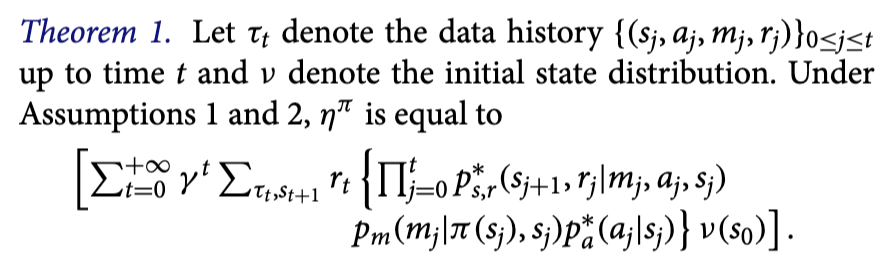 -->

> 定理 1 (可识别性) 记 $\tau = \{ (s_j, a_j, m_j, r_j)\}_{j=0}^{t}$ 为截止到 $t$ 时刻的数据历史，并记 $\nu$ 为初始状态分布。如果数据生成过程满足上述有向图模型，那么 $\eta^\pi$ 等于
> $$\mathbb{E} \left[\sum_{t=0}^\infty \gamma^t \sum_{\tau_t, s_{t+1}} r_t \left\{ \prod_{j=0}^t p^*_{s, r}(s_{j+1}, r_j|m_j, a_j, s_j) p_{m}(m_j | \pi(s_j), s_j) p_a^*(a_j|s_j) \right\} \nu(s_0)\right]$$

其中$p^*_a$ 代表给定$S_t$时$A_t$的分布, $p_m$ 是给定$S_t, A_t$时$M_t$的分布, $p^∗_{s,r}$是给定 $M_t, A_t, S_t$时 $S_{t+1} , R_t$的联合分布。请注意，分布$p^∗_{s,r},p_m$和$p^∗_a$都不涉及未观测的混淆因素。因此，这些分布函数可以基于观测数据相合地估计。定理 1 的证明迭代地利用到：

> 有向图模型中隐含的马尔科夫性质，

> 因果推断中的前门准则原理，

其中，前者保证了给定$S_t$, $t$时刻之前的变量 $\{S_j, U_j, A_j, M_j, R_j\}_{j<t}$ 与 $t$时刻的变量 $U_t, A_t, M_t, R_t$ 独立。因此，问题可以被简化为研究给定$S_t$的设定下，$t$时刻策略$\pi$带来的收益$R_t$。进一步，在$t$时刻，我们可以利用前门准则原理导出只依赖于观测数据潜在分布的表达式。

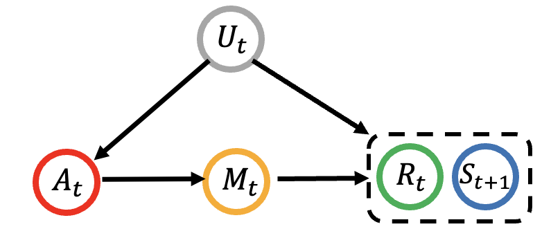

### 双重稳健区间估计

定理 1 告诉了我们可以通过观测数据估计$\eta^\pi$，但这实际计算依旧是困难的，因为其中涉及到了无穷项求和。为了避免这一困难，我们提出了如下双重稳健估计算法：

<!-- 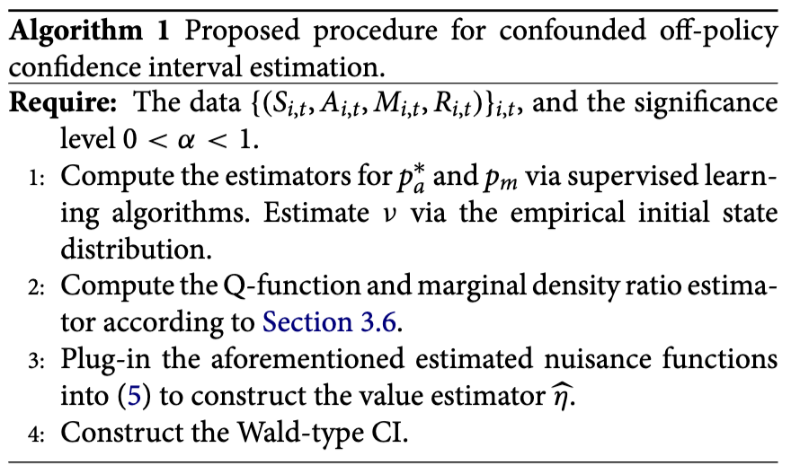 -->

> 算法 1 (**C**onfounded **O**ff-**P**olicy interval **E**stimation, **COPE**)
> 输入：数据集$\{(S_{i, t}, A_{i, t}, M_{i, t}, R_{i, t})\}_{i, t}$，名义显著性水平 $\alpha$
> 1. 通过监督学习方法计算$p^∗_a$和$p_m$的估计值。通过初始状态数据的经验分布估计$\nu$。
> 2. 根据第3.6节的方法计算 Q 函数和边际密度比率估计。
> 3. 将上述估计的估计函数代入双重稳健估计的表达式$\psi$从而给出对于长期收益的点估计$\hat{\eta}$。
> 4. 根据显著性水平 $\alpha$，构建瓦尔德型的置信区间

算法 1 的前两步计算几个函数作为计算$\hat{\eta}$的原材料。其中，第二步中的 Q 函数（Q-function，$Q^\pi$）和边际密度比（marginal density ratio, $\omega^\pi$）的定义都涉及到了无穷项求和，但他们都可以通过数据驱动的方法很容易地进行估计。以此，我们可以避免前面提到的无穷项求和。

在算法的第三步中，我们将对于$p_a^*, p_m, \nu, Q^\pi, \omega^\pi$的估计函数以及观测数据$O_{i,t}=(S_{i,t}, A_{i,t}, M_{i,t}, R_{i, t}, S_{i, t+1})$代入公式(5)：
$$
\hat{\eta} = \frac{1}{\sum_{i=1}^{N} T_i} \sum_{i=1}^{N} \sum_{t=0}^{T_i-1} \psi(O_{i,t}|\hat{p}_a^*, \hat{p}_m, \hat{\nu}, \hat{Q}^\pi, \hat{\omega}^{\pi}).
$$

可以证明，只要两组模型 $\mathcal{M}_1 = \{p_m, p_a^*, Q^\pi\}, \mathcal{M}_2 = \{p_m, \omega^{\pi}\}$ 中的至少一组模型是正确设定的，那么 $\hat{\eta}$就是关于$\eta^\pi$的无偏估计。如下的实验结果也验证了这一点：

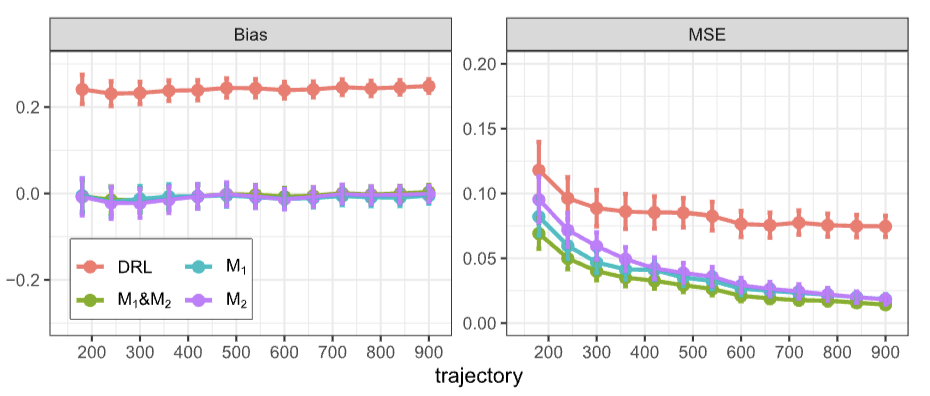

在算法的第 4 步中，我们会针对每个个体计算 

$$\eta_i = \sum_{t=0}^{T_i-1} \psi(O_{i,t}|\hat{p}_a^*, \hat{p}_m, \hat{\nu}, \hat{Q}^\pi, \hat{\omega}^{\pi}),$$ 

并计算出他们的标准差$\hat{\sigma}_{\eta}^2 = \textup{Std}(\{\eta_i\}_{i=1}^N)$。那么，我们可以构造一个 Wald 类型的统计量 

$$[\hat{\eta} - z_{\alpha/2}N^{-1/2}\hat{\sigma}_{\eta}^2, \; \hat{\eta} + z_{\alpha/2}N^{-1/2}\hat{\sigma}_{\eta}^2].$$

<!-- $\psi_1(O)$的表达式为：

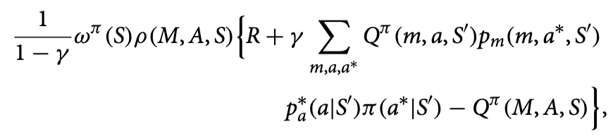

$\psi_2(O)$的表达式为：

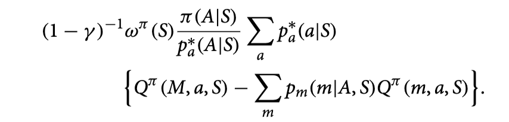

$\psi_3(O)$的表达式为：

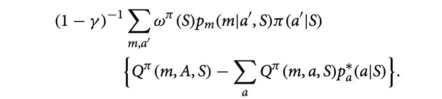 -->

### 理论保证

对于所提出的 COPE 方法，我们很自然的关心如下三个问题：

- COPE 是否是一个无偏估计？

- 相比其他的无偏估计，COPE 是否是方差最小的估计？

- COPE 给出的置信区间是否是准确的？

如下理论结果确立了方法的统计理论保证。首先，定理 2 表明，$\hat{\eta}$ 依概率 1 收敛到真实的长期策略收益 $\eta^\pi$。

<!-- 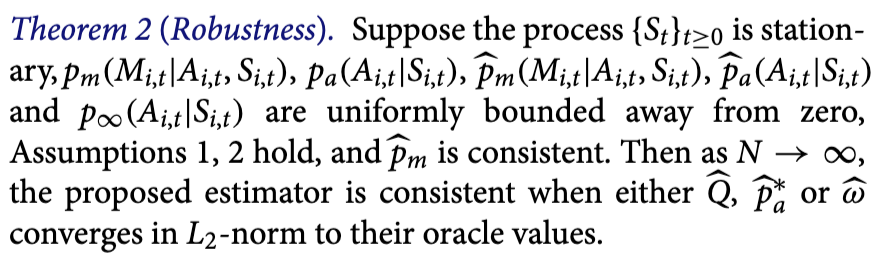 -->

> 定理 2 (双重稳健性) 假设定理 1 的条件成立，过程 $\{S_t\}_{t \geq 0}$ 是平稳的，并且$p_{m}(M_{i,t} | A_{i,t},S_{i,t}), p_{a}(A_{i,t}|S_{i,t}), \hat{p}_{m}(M_{i,t}| A_{i,t},S_t), \hat{p}_{a}(A_{i,t}|S_{i,t}), p_{\infty}(A_{i,t}|S_{i,t})$ 一致地远离 0。若估计函数具有适当的模型复杂度且其中的 $\hat{p}_m$ 是相合估计，并且两组模型 $\{ \hat{Q}^\pi, \hat{p}_m \}, \{ \hat{\omega}^\pi \}$ 中的至少一组依$L_2$-范数收敛到他们的神谕值，那么，随着 $N \rightarrow \infty$, $\hat{\eta}$ 具有相合性。

定理 2 允许估计函数 $\hat{p}_a^*, \hat{p}_m, \hat{Q}, \hat{\omega}$ 具有灵活的模型复杂度，换句话说，我们允许型中参数的数量随着样本量增加而增加。因此，我们可以使用目前强大的机器学习方法，如神经网络和回归树，估计$\hat{Q}, \hat{\omega}$，以减小由于模型错误设定导致的估计偏差。

第二个关于 $\eta^\pi$ 的理论结果表明，在数据量足够大时， $\eta^\pi$ 能以最高的效率估计 $\eta^\pi$。

<!-- 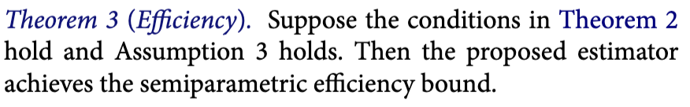 -->

> 定理3（高效性）假设定理 2 中的条件成立并且估计函数能以超过$N^{-\frac{1}{4}}$的速率依$L_2$范数收敛到神谕值，那么所提出的估计方法达到半参数有效性的上界。

最后一个理论结果表明所提出的区间估计是准确的：
<!-- --- 当数据量足够大时，我们构建的区间估计能以设定的置信水平覆盖真实的 $\eta^\pi$。 -->

<!-- 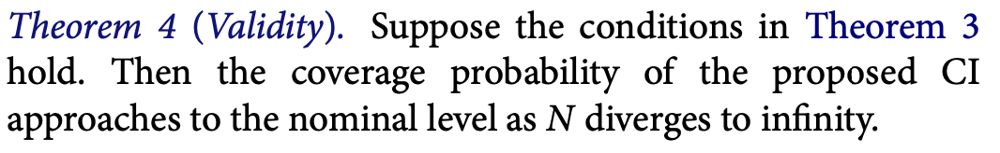 -->

> 定理4（有效性）。若定理 3 中的条件成立，那么所提出的区间估计的覆盖 $\eta^\pi$ 的概率随着 $N \to \infty$ 而趋近显著性水平。

## 顺风车平台策略验证

我们感兴趣于评估两个推荐策略。其中一个是随机策略（记为$\pi_1$），对于该策略，每个客户有50%的概率获得 8 折优惠券。另一个策略（记为$\pi_2$）依赖于用户请求区域的供需不平衡度量。具体来说，对于空车司机数量远超请求的地区，客户获得 8 折优惠券的概率提高到70\%。对于其他地区，客户有30\%的机会获得优惠券。

我们预计第二种策略会产生更大的长期收益，因为它不仅能鼓励客户下单，并推动了顺风车市场的供需平衡。通过数据我们可以估计出前述的有向图模型，并基于大量的蒙特卡罗抽样测算两个策略 $\pi_1, \pi_2$ 的长期收益。因为对长期效果感兴趣，我们在设定折现率$\gamma=0.99$的情况下，测算出的两个策略的差异值$\eta^{MC}_{\pi_2}-\eta^{MC}_{\pi_1} = 0.17$。这与我们预期的第二种策略产生更大的价值一致。进一步，我们基于估算的有向图模型生成仿真数据，并通过均方误差(MSE)以及置信区间的覆盖概率来评估所提出的方法（记为COPE）的准确性。下图描述了四种方法的性能。

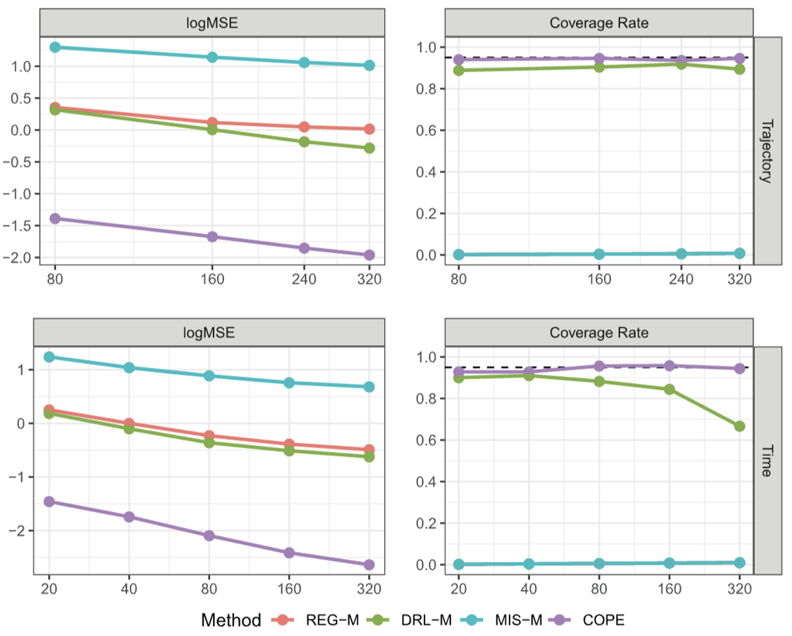

从结果首先可以看出，COPE在四种方法中具有最佳的估计准确性。其次，COPE 给出的置信区间的覆盖率接近设定的显著性水平。相反，当$N$或$T$较大时，其他三种基准方法无法达到显著性水平，并且具有明显更大的估计误差。

最后，我们将COPE应用于原始数据集以评估价值差异$\eta_{\pi_2}-\eta_{\pi_1}$。作为对比，我们将比较未考虑混淆因素的DRL方法。结果表明，COPE估算两个策略的长期价值的差异达到 0.63，95%的相关置信区间为[0.03,1.23]。因此，第二种策略显着优于第一种策略。这个结果与我们的预期一致。相反，DRL产生了-0.96的价值差异，相关的置信区间为[-2.07，0.14]。根据DRL反映了随机策略或许更好。但这其实是由于DRL无法处理未观测的混淆因素导致了估计结果存在偏差。

## 相关链接

- 相关论文："[Off-Policy Confidence Interval Estimation with Confounded Markov Decision Process](https://arxiv.org/pdf/2202.10589.pdf)" (JASA, 2022)

- 代码实现：https://github.com/Mamba413/cope

